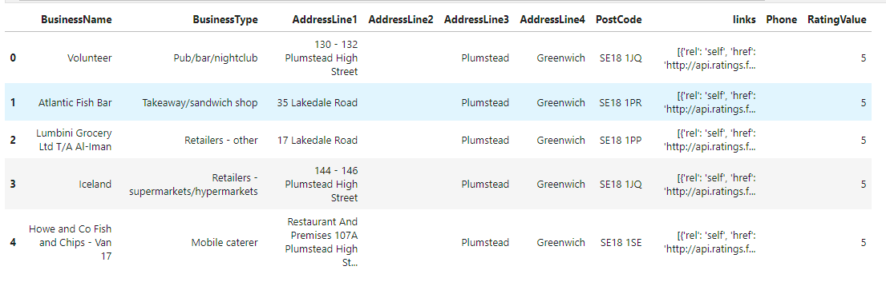

# Nosql-challenge

<h3>Overview</h3>

Assumed that I was contracted by the editors of a food magazine, Eat Safe, Love in United Kingdom to evaluate some of the ratings data in order to help their journalists and food critics decide where to focus future ariticles

Goal:
<ul>
    <li>Import json format file "establishments.json" to MongoDB server 'uk_food' and collection 'establishments.' Then, assign the 'establishments' collection to a variable to prepare the collection for use </li>
    <li>Modify database for a new restaurant name 'Penang Falvours,' which just opened in Greenwich, and remove the list of documents in Dover Local Authority</li>
    <li>Data Type update/conversion before explore data from string to integer/decimal numbers</li>
    <li>Explore data to provide editors which will help them find the locations they wish to visit and avoid</li>
</ul>

<h3>Tools and Techniques</h3>

<ul>
    <li>MongoDB</li>
    <li>Jupyter Notebook</li>
    <li>Python</li>
    <li>Pandas</li>
</ul>

<h2>Data Analysis</h2>

<h4>Questions</h4>
<ol>
    <li>Which establishments have a hygiene score equal to 20?</li>
    <li>Which establishments in London have a RatingValue greater than or equal to 4?</li>
    <li>What are the top 5 establishments with a RatingValue rating value of 5, sorted by lowest hygiene score, nearest to the new restaurant added, "Penang Flavours"?</li>
    <li>How many establishments in each Local Authority area have a hygiene score of 0?</li>
</ol>

<h4>Answers</h4>

<ol>
    <li>There are 41 establishments with a hygiene score of 20</li>
    <li>There are 33 establishments in London that have a RatingValue greater than or equal to 4</li>
    <li></li>
    <li>There are 55 documents in the result.</li>
</ol>

<h3>Conclusion</h3>

This assignment showcased how we can import data to MongoDB and clean up the data before executing data analysis in Pandas

